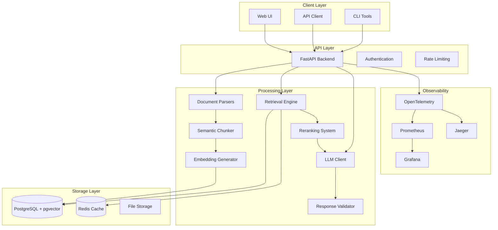
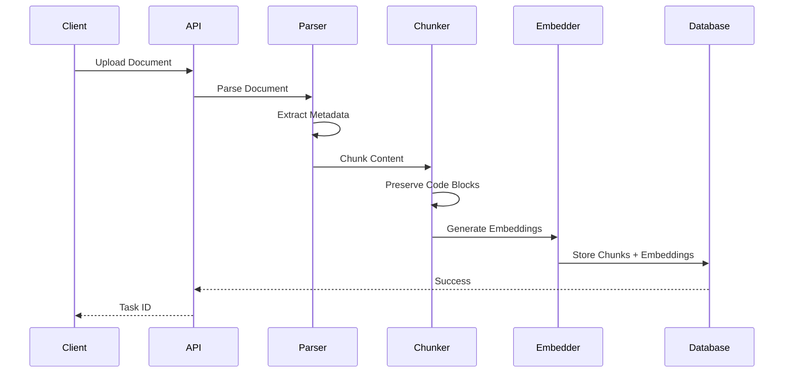
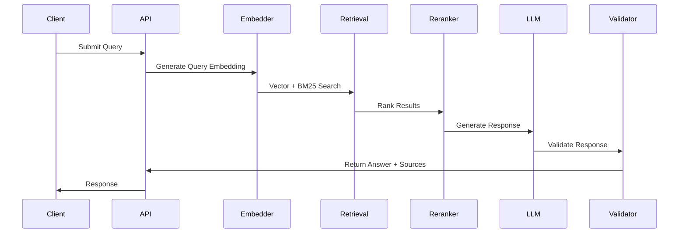

# System Architecture

This document provides a comprehensive overview of the Ops Runbook RAG system architecture, designed for research in operational knowledge management.

## High-Level Architecture



## Core Components

### 1. Document Ingestion Pipeline

**Purpose**: Multi-modal document processing with research-specific features.

**Components**:
- **Parsers**: Markdown, JSON, Screenshot (OCR), PDF RCA
- **Chunker**: Semantic chunking with code block preservation
- **Embedder**: Multi-provider embedding generation
- **Storage**: PostgreSQL with pgvector for vector storage

**Research Features**:
- Metadata-aware parsing for operational context
- Code block preservation for command extraction
- Section-aware chunking for runbook structure
- Temporal decay for incident relevance

### 2. Retrieval System

**Purpose**: Hybrid retrieval combining dense and sparse search methods.

**Architecture**:
```
Query → Embedding → Vector Search → BM25 Search → Fusion → Reranking → Results
```

**Components**:
- **Vector Store**: pgvector for dense similarity search
- **Full-text Search**: PostgreSQL tsvector for sparse matching
- **Fusion**: Reciprocal Rank Fusion (RRF) for combining results
- **Reranking**: Cohere API + cross-encoder models
- **Temporal Decay**: Time-based scoring for incident relevance

**Research Innovations**:
- Metadata-aware SQL filtering
- Temporal relevance modeling
- Multi-stage retrieval pipeline
- Context-aware reranking

### 3. Generation System

**Purpose**: Incident-aware response generation with validation.

**Components**:
- **LLM Client**: Multi-provider (OpenAI, Anthropic) with fallback
- **Prompt Templates**: Incident-type-specific prompting
- **Response Validator**: Command safety and hallucination detection
- **Citation System**: Source attribution and confidence scoring

**Research Features**:
- Incident-type-aware prompting
- Few-shot examples for operational scenarios
- Multi-layer response validation
- Confidence scoring and source attribution

### 4. Observability System

**Purpose**: Comprehensive monitoring and research analytics.

**Components**:
- **OpenTelemetry**: Distributed tracing across all operations
- **Prometheus**: Metrics collection and storage
- **Grafana**: Research dashboards and analytics
- **Jaeger**: Trace visualization and analysis

**Research Metrics**:
- Retrieval latency and accuracy
- LLM token usage and costs
- Cache hit ratios and performance
- SLI/SLO compliance tracking

## Data Flow

### 1. Document Ingestion Flow



### 2. Query Processing Flow



## Storage Architecture

### PostgreSQL + pgvector

**Schema Design**:
```sql
-- Documents table
documents (id, content, metadata, document_type, source_path, created_at)

-- Vector chunks table  
chunks (id, document_id, content, embedding, metadata, ts_vector, created_at)

-- Query history
queries (id, query_text, context, retrieved_chunks, llm_response, feedback_score)

-- Evaluation results
evaluation_results (id, query_id, metric_name, metric_value, evaluation_type)
```

**Indexes**:
- Vector similarity: `ivfflat` index on embeddings
- Full-text search: `GIN` index on `ts_vector`
- Metadata filtering: `GIN` index on metadata JSONB
- Temporal queries: B-tree index on `created_at`

### Redis Cache

**Cache Layers**:
- **Embedding Cache**: Reuse embeddings for repeated queries
- **Query Cache**: Cache retrieval results
- **Research Cache**: Store experiment data and analytics

**Cache Strategy**:
- TTL-based expiration
- LRU eviction policy
- Compression for large objects

## Research Features

### 1. Multi-Modal Document Processing

**Supported Formats**:
- **Markdown Runbooks**: Structured operational procedures
- **JSON KB Articles**: Knowledge base entries with steps
- **Screenshot Images**: Dashboard screenshots with OCR
- **PDF RCAs**: Root cause analysis documents

**Research Innovations**:
- Metadata extraction for operational context
- Code block preservation for command analysis
- Visual information extraction from screenshots
- Timeline and action item extraction from RCAs

### 2. Hybrid Retrieval System

**Dense Search**:
- OpenAI text-embedding-3-large (3072 dimensions)
- Sentence-transformers fallback
- Cosine similarity with pgvector

**Sparse Search**:
- PostgreSQL full-text search (BM25)
- Custom tokenization for operational terms
- Metadata-aware filtering

**Fusion Strategy**:
- Reciprocal Rank Fusion (RRF)
- Weighted combination of dense and sparse scores
- Temporal decay for incident relevance

### 3. Incident-Aware Generation

**Prompt Templates**:
- Rate limiting scenarios with backoff examples
- Cache invalidation procedures
- Deployment rollback steps
- Database troubleshooting guides

**Few-Shot Examples**:
- Real incident resolutions
- Command sequences for common issues
- Escalation procedures by severity

### 4. Response Validation

**Safety Checks**:
- Command blacklisting (dangerous operations)
- Syntax validation for shell commands
- Service awareness verification
- Hallucination detection

**Quality Metrics**:
- Confidence scoring
- Source attribution
- Actionability assessment

## Performance Characteristics

### Latency Targets

- **Query Response**: P95 < 3s, P99 < 5s
- **Document Ingestion**: ~10 documents/minute
- **Embedding Generation**: ~100 chunks/minute
- **Retrieval**: < 500ms for 50 candidates

### Scalability Limits

- **Documents**: 100K+ documents supported
- **Chunks**: 1M+ chunks with pgvector
- **Concurrent Queries**: 100+ concurrent users
- **Storage**: 10GB+ for embeddings and metadata

### Resource Requirements

- **Memory**: 2-8GB depending on dataset size
- **CPU**: 2-8 cores for optimal performance
- **Storage**: SSD recommended for vector operations
- **Network**: 100Mbps+ for API responses

## Security Considerations

### Data Protection

- **Encryption**: TLS for all API communications
- **Authentication**: JWT-based API authentication
- **Authorization**: Role-based access control
- **Data Privacy**: No PII storage in embeddings

### Operational Security

- **Command Validation**: Prevent dangerous command execution
- **Input Sanitization**: Protect against injection attacks
- **Rate Limiting**: Prevent abuse and DoS
- **Audit Logging**: Track all system interactions

## Deployment Architecture

### Development Environment

```yaml
# docker-compose.yml
services:
  backend: FastAPI application
  postgres: PostgreSQL + pgvector
  redis: Cache and session storage
  prometheus: Metrics collection
  grafana: Monitoring dashboards
  jaeger: Distributed tracing
```

### Production Environment

```yaml
# Kubernetes deployment
apiVersion: apps/v1
kind: Deployment
metadata:
  name: ops-runbook-rag
spec:
  replicas: 3
  template:
    spec:
      containers:
      - name: backend
        image: ops-runbook-rag:latest
        resources:
          requests:
            memory: "2Gi"
            cpu: "1000m"
          limits:
            memory: "4Gi"
            cpu: "2000m"
```

## Research Methodology

### Evaluation Framework

**Metrics**:
- **BLEU Score**: Answer quality assessment
- **ROUGE-L**: Answer completeness
- **Semantic Similarity**: BERTScore for relevance
- **Actionability Score**: Human evaluation (1-5)

**Datasets**:
- Curated incident set (100 queries)
- Real operational scenarios
- Ground-truth answers from experts
- Automated and human evaluation

### Experimental Design

**A/B Testing**:
- Prompt variations
- Retrieval strategies
- Reranking methods
- Response validation approaches

**Baseline Comparisons**:
- Standard RAG vs. incident-aware RAG
- Single vs. multi-modal retrieval
- Dense vs. hybrid search
- Temporal decay impact

## Future Research Directions

### 1. Advanced Retrieval

- **Multi-hop Reasoning**: Complex query decomposition
- **Temporal Reasoning**: Time-aware incident patterns
- **Causal Inference**: Root cause analysis automation
- **Active Learning**: Continuous improvement from feedback

### 2. Enhanced Generation

- **Multi-modal Responses**: Text + diagrams + commands
- **Interactive Debugging**: Step-by-step troubleshooting
- **Personalization**: User-specific response adaptation
- **Collaborative AI**: Human-AI collaboration patterns

### 3. Operational Intelligence

- **Predictive Maintenance**: Proactive issue detection
- **Incident Correlation**: Pattern recognition across incidents
- **Knowledge Evolution**: Automatic runbook updates
- **Team Learning**: Organizational knowledge transfer

## Conclusion

The Ops Runbook RAG system represents a comprehensive research platform for operational knowledge management. Its multi-modal architecture, hybrid retrieval system, and incident-aware generation capabilities provide a solid foundation for advancing the state of the art in operational AI systems.

The system's design prioritizes research flexibility while maintaining production readiness, enabling both academic research and practical deployment in operational environments.

---

**For implementation details, see:**
- [API Documentation](API.md)
- [Quick Start Guide](QUICK_START.md)
- [Runbook Authoring Guide](RUNBOOK_AUTHORING.md)
