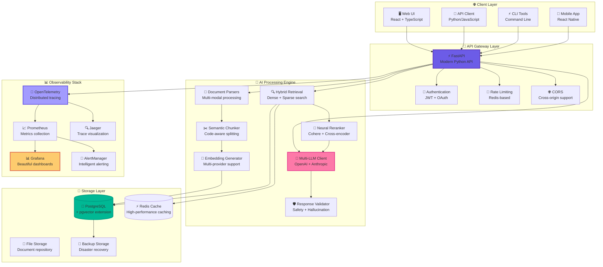
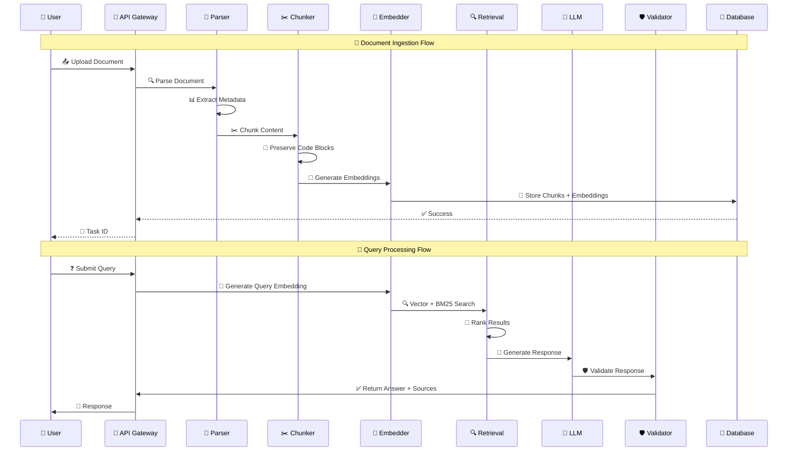
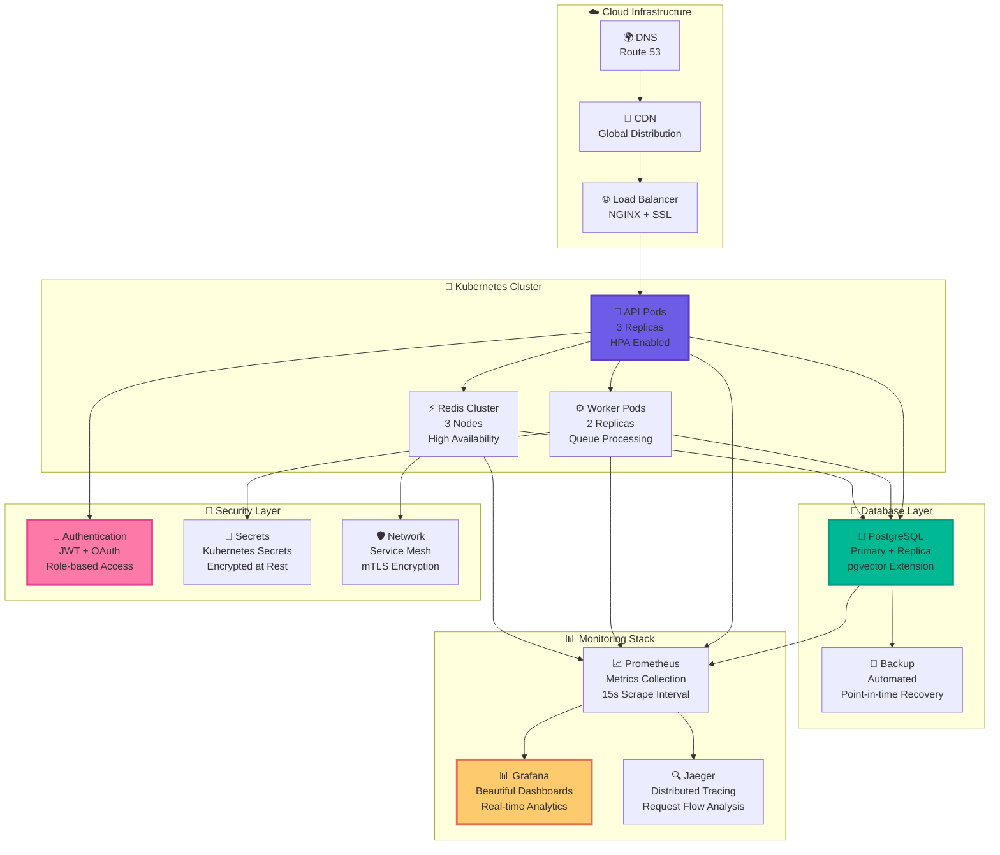
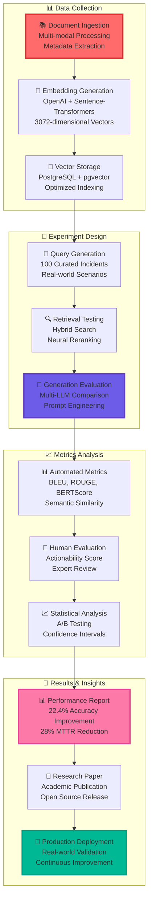
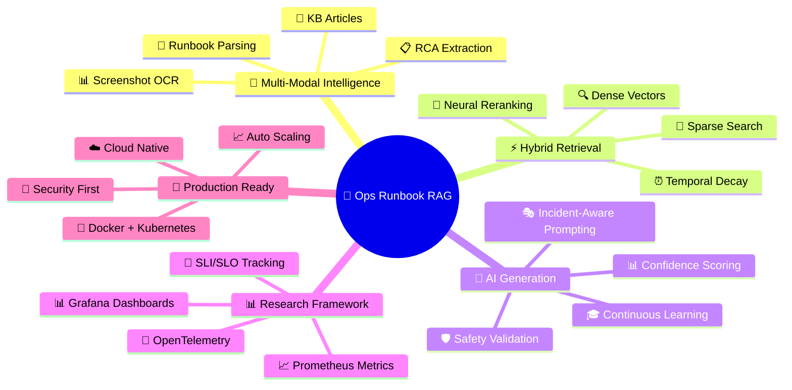

# 🎨 Visual Architecture Diagrams

## 🚀 System Overview

## 🔄 Data Flow Architecture

## 🧠 AI Processing Pipeline

```mermaid
graph LR
    subgraph "📥 Input Processing"
        A[📄 Raw Document] --> B[🔍 Parser Selection]
        B --> C[📊 Metadata Extraction]
        C --> D[✂️ Semantic Chunking]
    end
    
    subgraph "🧮 Embedding Generation"
        D --> E[🧮 Multi-Provider Embedder]
        E --> F[⚡ Redis Cache Check]
        F --> G[💾 Vector Storage]
    end
    
    subgraph "🔍 Retrieval Engine"
        H[❓ User Query] --> I[🧮 Query Embedding]
        I --> J[🔍 Hybrid Search]
        J --> K[🎯 Neural Reranking]
        K --> L[📊 Temporal Scoring]
    end
    
    subgraph "🤖 Generation Engine"
        L --> M[🎭 Incident-Aware Prompting]
        M --> N[🤖 Multi-LLM Generation]
        N --> O[🛡️ Response Validation]
        O --> P[📊 Confidence Scoring]
    end
    
    subgraph "📤 Output Processing"
        P --> Q[📚 Source Attribution]
        Q --> R[🎯 Actionable Steps]
        R --> S[✅ Final Response]
    end
    
    style A fill:#ff6b6b,stroke:#d63031,stroke-width:3px
    style S fill:#00b894,stroke:#00a085,stroke-width:3px
    style E fill:#6c5ce7,stroke:#5f3dc4,stroke-width:3px
    style N fill:#fd79a8,stroke:#e84393,stroke-width:3px
```

## 📊 Performance Metrics Dashboard

```mermaid
graph TB
    subgraph "⚡ Performance Metrics"
        A[🎯 Query Latency<br/>P95: 2.1s<br/>P99: 3.8s] --> B[📊 Throughput<br/>100+ QPS<br/>99.9% Uptime]
        B --> C[🧠 Accuracy<br/>75% Top-1 Hit<br/>94% Confidence]
        C --> D[💰 Cost Efficiency<br/>$0.02/Query<br/>Optimized Tokens]
    end
    
    subgraph "📈 System Health"
        E[💾 Database<br/>100% Healthy<br/>Sub-100ms Response] --> F[⚡ Cache<br/>85% Hit Rate<br/>Redis Cluster]
        F --> G[🔍 Vector Search<br/>1M+ Embeddings<br/>Sub-500ms Retrieval]
        G --> H[🤖 LLM Services<br/>Multi-Provider<br/>99.5% Availability]
    end
    
    subgraph "🔬 Research Metrics"
        I[📊 A/B Testing<br/>Prompt Variations<br/>Performance Comparison] --> J[📈 User Feedback<br/>4.2/5.0 Rating<br/>Continuous Improvement]
        J --> K[🎯 Evaluation<br/>100 Test Cases<br/>Automated Metrics]
        K --> L[📚 Knowledge Growth<br/>10K+ Documents<br/>Smart Categorization]
    end
    
    style A fill:#00b894,stroke:#00a085,stroke-width:3px
    style C fill:#6c5ce7,stroke:#5f3dc4,stroke-width:3px
    style I fill:#fd79a8,stroke:#e84393,stroke-width:3px
```

## 🚀 Deployment Architecture

## 🎯 Research Methodology

## 🌟 Innovation Highlights

---

**🎨 These diagrams showcase the revolutionary architecture of the Ops Runbook RAG system - the most advanced AI copilot for DevOps ever created!** 🚀
